Differential Alternative Splicing Analysis with rMATS
===

> **Note:** Pre-generated BAM files for this tutorial are available on Scratch at `/N/scratch/mbreese/rMATS_class`

For this hands-on, we'll be looking at the differences in splicing between two human tissues from ENCODE. We're going to be comparing skin to liver.

- [Differential Alternative Splicing Analysis with rMATS](#differential-alternative-splicing-analysis-with-rmats)
  - [Prerequisites](#prerequisites)
    - [Genome reference](#genome-reference)
    - [Downloads](#downloads)
      - [Example setup script](#example-setup-script)
  - [Samples](#samples)
    - [Downloading the files](#downloading-the-files)
  - [Installing rMATS\_turbo](#installing-rmats_turbo)
    - [Install rmats2sashimiplot](#install-rmats2sashimiplot)
- [Alignment](#alignment)
  - [Indexing BAM files](#indexing-bam-files)
- [Analysis](#analysis)
- [Differential expression w/rsem](#differential-expression-wrsem)
  - [Build the RSEM reference](#build-the-rsem-reference)
  - [Quantify each sample](#quantify-each-sample)
  - [Differential expression](#differential-expression)
- [Differential splicing rMATS](#differential-splicing-rmats)
  - [Preparing input files](#preparing-input-files)
  - [Running rMATS](#running-rmats)
  - [Pitfalls and gotchas](#pitfalls-and-gotchas)
  - [Output files](#output-files)
    - [Key columns in the output](#key-columns-in-the-output)
  - [Filtering significant events](#filtering-significant-events)
  - [Finding interesting events](#finding-interesting-events)
  - [Visualizing interesting events](#visualizing-interesting-events)
- [Visualizing splicing (IGV)](#visualizing-splicing-igv)
  - [Loading your data](#loading-your-data)
  - [Navigating to a splicing event](#navigating-to-a-splicing-event)
  - [Sashimi plots](#sashimi-plots)
- [Downstream Analysis](#downstream-analysis)
- [HPC Tips and tricks](#hpc-tips-and-tricks)
  - [Write scripts](#write-scripts)
    - [Try to use a workflow/pipeline manager](#try-to-use-a-workflowpipeline-manager)
    - [Write to tmp files](#write-to-tmp-files)
  - [Use `screen` or `tmux` for long-running sessions](#use-screen-or-tmux-for-long-running-sessions)
  - [Keep your own reference files](#keep-your-own-reference-files)
- [Additional resources](#additional-resources)

## Prerequisites

1. Genome reference FASTA (for aligning)
2. Gene model GTF file (for aligning)
3. Input FASTQ files

### Genome reference 

For the genome reference we will use GRCh38p14. This is the most recent version.

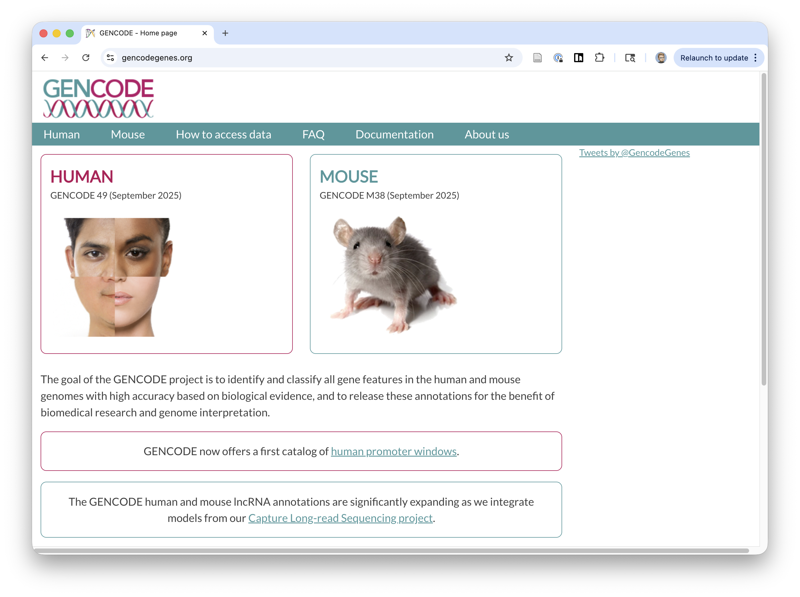

### Downloads

You'll need to download the GTF file and FASTA reference sequences for GRCh38. 

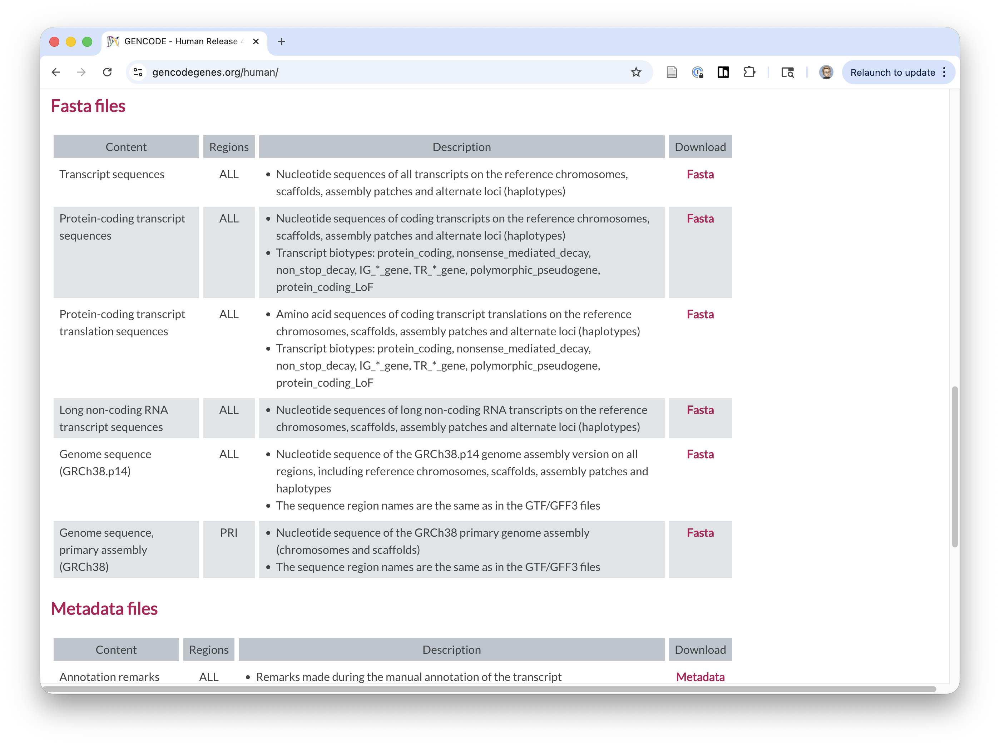

For the FASTA reference, we'll use the full GRCh38.p14 version. This includes all chromosomes and alternative assemblies/contigs. This is the most complete version, but some annotations aren't always needed. For clinical work, you may want to only use the "PRI" primary assemby version that only includes chr1-22, X, Y, MT.

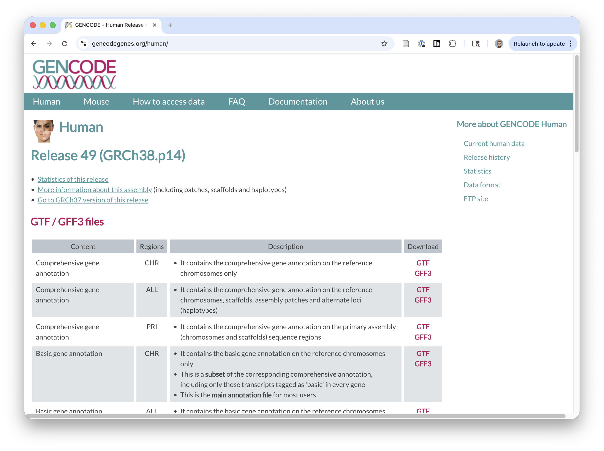

The GTF file we'll use is the "Comprehensive gene annotation" (ALL) version. This has all known annotated genes for all chromosomes and alternative assemblies/contigs.

#### Example setup script

This will download and create a STAR index for GRCh38p14. Warning -- the STAR index job will take time and memory to complete *(~ 1h15m with 48GB of RAM, 8 procs)*.

Try to create this index once and keep it!

```00-setup.sh
#!/bin/bash
READ_OVERHANG=100 # read length - 1

cd $(dirname $0)

module add star

mkdir -p fastq ref aligned

cd ref/

if [ ! -e GRCh38.p14.genome.fa.gz ]; then
    echo "Downloading GRCh38p14"
    curl -LO https://ftp.ebi.ac.uk/pub/databases/gencode/Gencode_human/latest_release/GRCh38.p14.genome.fa.gz
fi
if [ ! -e gencode.v49.annotation.gtf.gz ]; then
    echo "Downloading Gencode V49 GTF"
    curl -LO https://ftp.ebi.ac.uk/pub/databases/gencode/Gencode_human/latest_release/gencode.v49.annotation.gtf.gz
fi


if [ ! -e GRCh38.p14.genome.fa ]; then
    echo "Decompressing FASTA"
    zcat GRCh38.p14.genome.fa.gz > GRCh38.p14.genome.fa
fi

if [ ! -e gencode.v49.annotation.gtf ]; then
    echo "Decompressing GTF"
    zcat gencode.v49.annotation.gtf.gz > gencode.v49.annotation.gtf
fi

if [ ! -e SAindex ]; then
    echo "Creating STAR index"
    STAR \
      --runMode genomeGenerate \
      --genomeDir . \
      --genomeFastaFiles GRCh38.p14.genome.fa \
      --sjdbGTFfile gencode.v49.annotation.gtf \
      --sjdbOverhang $READ_OVERHANG \
      --runThreadN 8
fi
```

## Samples

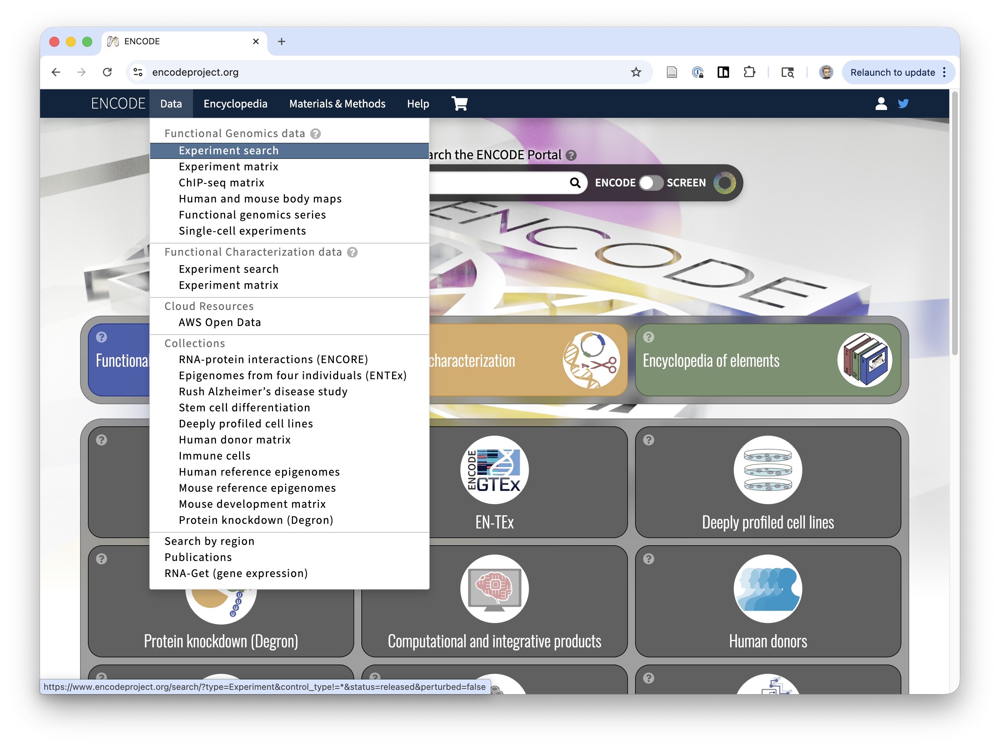

For this, we will be using FASTQ files from the ENCODE project. The major goal is to produce a comprehensive list of functional regulatory elements. To do this, ENCODE creates and collects community resources of genomics data, software, and tools for genomics analysis. 

We are going to use some of their data to explore splicing.


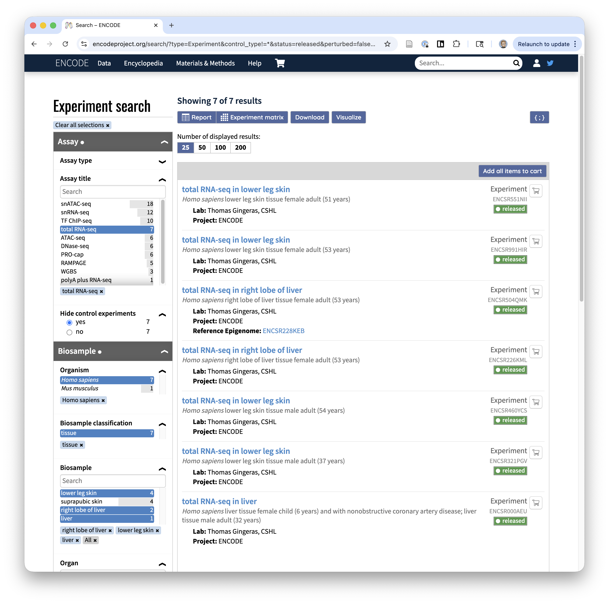

From the "Data > Experimental search page", we can set some filters. Specifically, we are going to look for:

    * Total RNAseq
    * Human
    * Tissue
    * From the lower leg, liver, or right lobe of liver
    * That is paired-ended (R1/R2)


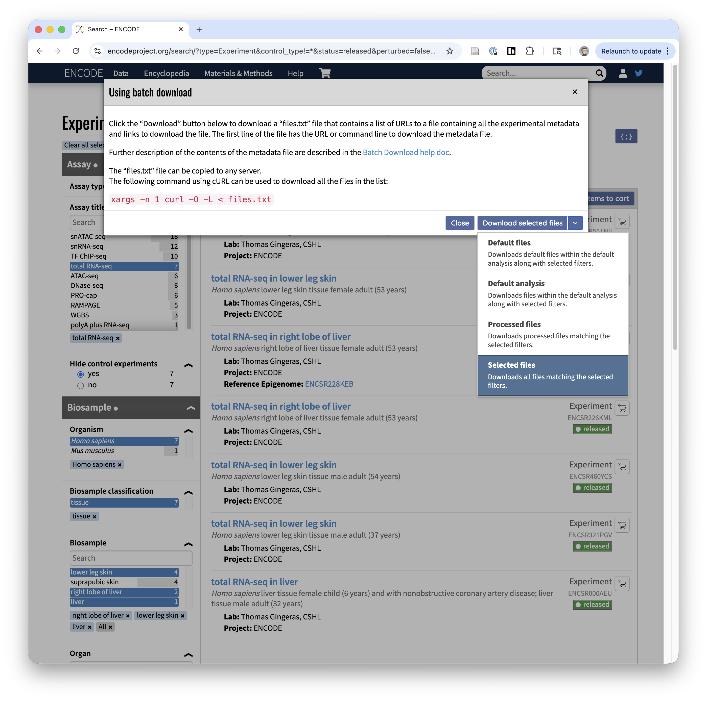

When we do this, we get 7 samples. If we click "Download > Download selected files", we get a list of files (FASTQ) that we can download.

### Downloading the files

Above, we get a file like this: 

```
"https://www.encodeproject.org/metadata/?control_type%21=%2A&status=released&perturbed=false&assay_title=total+RNA-seq&replicates.library.biosample.donor.organism.scientific_name=Homo+sapiens&biosample_ontology.classification=tissue&biosample_ontology.term_name=right+lobe+of+liver&biosample_ontology.term_name=lower+leg+skin&biosample_ontology.organ_slims=liver&biosample_ontology.organ_slims=skin+of+body&replicates.library.biosample.life_stage=adult&files.run_type=paired-ended&biosample_ontology.term_name=liver&type=Experiment"
https://www.encodeproject.org/files/ENCFF001RTX/@@download/ENCFF001RTX.fastq.gz
https://www.encodeproject.org/files/ENCFF001RUA/@@download/ENCFF001RUA.fastq.gz
https://www.encodeproject.org/files/ENCFF001RTZ/@@download/ENCFF001RTZ.fastq.gz
https://www.encodeproject.org/files/ENCFF001RTY/@@download/ENCFF001RTY.fastq.gz
https://www.encodeproject.org/files/ENCFF052TFM/@@download/ENCFF052TFM.fastq.gz
https://www.encodeproject.org/files/ENCFF446HCJ/@@download/ENCFF446HCJ.fastq.gz
https://www.encodeproject.org/files/ENCFF623WSO/@@download/ENCFF623WSO.fastq.gz
https://www.encodeproject.org/files/ENCFF728KPM/@@download/ENCFF728KPM.fastq.gz
https://www.encodeproject.org/files/ENCFF008OVI/@@download/ENCFF008OVI.fastq.gz
https://www.encodeproject.org/files/ENCFF431RAQ/@@download/ENCFF431RAQ.fastq.gz
https://www.encodeproject.org/files/ENCFF732GVX/@@download/ENCFF732GVX.fastq.gz
https://www.encodeproject.org/files/ENCFF235JEO/@@download/ENCFF235JEO.fastq.gz
https://www.encodeproject.org/files/ENCFF906OKN/@@download/ENCFF906OKN.fastq.gz
https://www.encodeproject.org/files/ENCFF483AGL/@@download/ENCFF483AGL.fastq.gz
https://www.encodeproject.org/files/ENCFF381FTA/@@download/ENCFF381FTA.fastq.gz
https://www.encodeproject.org/files/ENCFF151LEE/@@download/ENCFF151LEE.fastq.gz
```

If we save this as 'files.txt', these files can be downloaded using a one-liner: `xargs -n 1 curl -O -L < files.txt`. But that doesn't tell the whole story, as we also need to know which files belong to which sample, if there are biological replicates, and which file is R1/R2. This information is kept in the first line.

Here is an example download script (uses the program tabl to pull out columns:

```01-download.sh
#!/bin/bash

cd $(dirname $0)

echo "file      pair    repl    sample  tissue  url" > pairs.txt
tabl export 'File accession','Paired end','Biological replicate(s)','Experiment accession','Biosample term name','File download URL' samples.txt | tail -n +2 >> pairs.txt

while read -r file pair repl sample tissue url; do
if [ $file = "file" ]; then
        continue
fi
FQ=$file.fastq.gz
FQ2="fastq/${sample}_rep${repl}_R${pair}.fastq.gz"
if [ -e "$FQ2" ]; then
        echo "$FQ2 downloaded"
        continue
fi
if [ -e "$FQ" ]; then
        mv $FQ $FQ2
        continue
fi
curl -LO $url > $FQ2.tmp && mv $FQ2.tmp $FQ2
done < pairs.txt


cd refs/
if [ ! -e GRCh38.p14.genome.fa.gz ]; then
curl -LO https://ftp.ebi.ac.uk/pub/databases/gencode/Gencode_human/latest_release/GRCh38.p14.genome.fa.gz
fi
cd ..
```

If we re-work this samples text file, we get the following information:

```pairs.txt
file    pair    repl    sample  tissue  url
ENCFF001RTX     2       2       ENCSR000AEU     liver   https://www.encodeproject.org/files/ENCFF001RTX/@@download/ENCFF001RTX.fastq.gz
ENCFF001RUA     1       1       ENCSR000AEU     liver   https://www.encodeproject.org/files/ENCFF001RUA/@@download/ENCFF001RUA.fastq.gz
ENCFF001RTZ     2       1       ENCSR000AEU     liver   https://www.encodeproject.org/files/ENCFF001RTZ/@@download/ENCFF001RTZ.fastq.gz
ENCFF001RTY     1       2       ENCSR000AEU     liver   https://www.encodeproject.org/files/ENCFF001RTY/@@download/ENCFF001RTY.fastq.gz
ENCFF052TFM     1       1       ENCSR551NII     lower leg skin  https://www.encodeproject.org/files/ENCFF052TFM/@@download/ENCFF052TFM.fastq.gz
ENCFF446HCJ     2       1       ENCSR551NII     lower leg skin  https://www.encodeproject.org/files/ENCFF446HCJ/@@download/ENCFF446HCJ.fastq.gz
ENCFF623WSO     1       1       ENCSR460YCS     lower leg skin  https://www.encodeproject.org/files/ENCFF623WSO/@@download/ENCFF623WSO.fastq.gz
ENCFF728KPM     2       1       ENCSR460YCS     lower leg skin  https://www.encodeproject.org/files/ENCFF728KPM/@@download/ENCFF728KPM.fastq.gz
ENCFF008OVI     2       1       ENCSR321PGV     lower leg skin  https://www.encodeproject.org/files/ENCFF008OVI/@@download/ENCFF008OVI.fastq.gz
ENCFF431RAQ     1       1       ENCSR321PGV     lower leg skin  https://www.encodeproject.org/files/ENCFF431RAQ/@@download/ENCFF431RAQ.fastq.gz
ENCFF732GVX     1       1       ENCSR991HIR     lower leg skin  https://www.encodeproject.org/files/ENCFF732GVX/@@download/ENCFF732GVX.fastq.gz
ENCFF235JEO     2       1       ENCSR991HIR     lower leg skin  https://www.encodeproject.org/files/ENCFF235JEO/@@download/ENCFF235JEO.fastq.gz
ENCFF906OKN     1       1       ENCSR226KML     right lobe of liver     https://www.encodeproject.org/files/ENCFF906OKN/@@download/ENCFF906OKN.fastq.gz
ENCFF483AGL     2       1       ENCSR226KML     right lobe of liver     https://www.encodeproject.org/files/ENCFF483AGL/@@download/ENCFF483AGL.fastq.gz
ENCFF381FTA     1       1       ENCSR504QMK     right lobe of liver     https://www.encodeproject.org/files/ENCFF381FTA/@@download/ENCFF381FTA.fastq.gz
ENCFF151LEE     2       1       ENCSR504QMK     right lobe of liver     https://www.encodeproject.org/files/ENCFF151LEE/@@download/ENCFF151LEE.fastq.gz
```

And this is what we end up with for input FASTQ files

```
-rw-rw-r-- 1 mbreese mbreese 14323556875 Mar 23 04:50 ENCSR000AEU_rep1_R1.fastq.gz
-rw-rw-r-- 1 mbreese mbreese 14747738105 Mar 23 04:56 ENCSR000AEU_rep1_R2.fastq.gz
-rw-rw-r-- 1 mbreese mbreese 14578828173 Mar 23 05:02 ENCSR000AEU_rep2_R1.fastq.gz
-rw-rw-r-- 1 mbreese mbreese 14495108389 Mar 23 04:45 ENCSR000AEU_rep2_R2.fastq.gz
-rw-rw-r-- 1 mbreese mbreese  3860638285 Mar 23 05:03 ENCSR226KML_rep1_R1.fastq.gz
-rw-rw-r-- 1 mbreese mbreese  3953180447 Mar 23 05:05 ENCSR226KML_rep1_R2.fastq.gz
-rw-rw-r-- 1 mbreese mbreese  5169945610 Mar 23 04:53 ENCSR321PGV_rep1_R1.fastq.gz
-rw-rw-r-- 1 mbreese mbreese  5314653732 Mar 23 04:51 ENCSR321PGV_rep1_R2.fastq.gz
-rw-rw-r-- 1 mbreese mbreese  3944321320 Mar 23 04:48 ENCSR460YCS_rep1_R1.fastq.gz
-rw-rw-r-- 1 mbreese mbreese  4098935200 Mar 23 04:50 ENCSR460YCS_rep1_R2.fastq.gz
-rw-rw-r-- 1 mbreese mbreese  4927933692 Mar 23 05:07 ENCSR504QMK_rep1_R1.fastq.gz
-rw-rw-r-- 1 mbreese mbreese  5039324516 Mar 23 05:09 ENCSR504QMK_rep1_R2.fastq.gz
-rw-rw-r-- 1 mbreese mbreese  4921859807 Mar 23 04:45 ENCSR551NII_rep1_R1.fastq.gz
-rw-rw-r-- 1 mbreese mbreese  5113550814 Mar 23 04:46 ENCSR551NII_rep1_R2.fastq.gz
-rw-rw-r-- 1 mbreese mbreese  4910763427 Mar 23 04:55 ENCSR991HIR_rep1_R1.fastq.gz
-rw-rw-r-- 1 mbreese mbreese  5123360411 Mar 23 04:57 ENCSR991HIR_rep1_R2.fastq.gz
```

## Installing rMATS_turbo

For STAR and rsem, we have modules available on Quartz. We can just use those without installing anything. This isn't the case with rMATS. We'll need to install this in our environment. The easiest way to do this is with Conda.

    module add conda
    
    conda create -n rmats -c bioconda -c conda-forge rmats
    # Say yes to adding new packages.

    conda activate rmats

Now, if you type `rmats.py --help`, you should get the rMATS help text. 

### Install rmats2sashimiplot

rmats2sashimiplot is a visualization tool that works with the rMATs input files to make nice splicing graphics. It can also be installed with conda, so I recommend installing it in the same conda environment.

    conda install -c bioconda -c conda-forge rmats2sashimiplot


# Alignment

Align your FASTQ files to the reference genome using the STAR two-step protocol.

```
STAR \
  --runMode alignReads \
  --genomeDir /path/to/star_index \
  --readFilesIn read1.fastq.gz read2.fastq.gz \
  --readFilesCommand zcat \
  --outSAMtype BAM SortedByCoordinate \
  --outFileNamePrefix output/ \
  --twopassMode Basic \
  --outSAMattributes NH HI AS NM MD \
  --outSAMunmapped Within \
  --quantMode TranscriptomeSAM \
  --runThreadN 8
```

STAR produces two BAM files per sample:
- `Aligned.sortedByCoord.out.bam` — genome-aligned, used by rMATS
- `Aligned.toTranscriptome.out.bam` — transcriptome-aligned, used by RSEM

## Indexing BAM files

rMATS requires each BAM to be indexed before use. Run `samtools index` on every genome-aligned BAM:

```bash
samtools index sample/Aligned.sortedByCoord.out.bam
```

This creates a `.bai` index file alongside the BAM. You can loop over all samples:

```bash
for bam in aligned/*/Aligned.sortedByCoord.out.bam; do
    samtools index $bam
done
```


# Analysis

Once we have the STAR aligned BAM files, we can start the rest of the analysis. RSEM is a popular pipeline for helping to quantify gene counts and isoforms. Below is the expected data flow chart showing what we can search for in these data.

```
RSEM expected_count
       ↓
   DESeq2 / edgeR       ← differential gene expression
   
RSEM isoform TPM
       ↓
   dexseq / isoformSwitchAnalyzeR   ← isoform switching

STAR BAM
       ↓
   rMATS                ← differential splicing events (ΔPSI)
```

We are focused on the rMATS part here.


# Differential expression w/rsem

RSEM quantifies expression from the transcriptome-aligned BAM that STAR produced (`Aligned.toTranscriptome.out.bam`). It outputs both gene-level expected counts (for DESeq2/edgeR) and isoform-level TPM values.

## Build the RSEM reference

This only needs to be done once per genome/annotation combination:

```bash
rsem-prepare-reference \
  --gtf ref/gencode.v49.annotation.gtf \
  ref/GRCh38.p14.genome.fa \
  ref/rsem/GRCh38
```

## Quantify each sample

Run once per sample. Use `--paired-end` since our ENCODE data is paired-end, and `--strandedness reverse` for typical stranded total RNA-seq libraries.

```bash
rsem-calculate-expression \
  --paired-end \
  --alignments \
  --strandedness reverse \
  --num-threads 8 \
  aligned/SAMPLE/Aligned.toTranscriptome.out.bam \
  ref/rsem/GRCh38 \
  rsem/SAMPLE
```

This produces:
- `SAMPLE.genes.results` — gene-level expected counts and TPM
- `SAMPLE.isoforms.results` — isoform-level expected counts and TPM

## Differential expression

Collect the `expected_count` column from each `*.genes.results` file and load into DESeq2 or edgeR for differential expression analysis between skin and liver. This is out of scope for this hands-on but the RSEM output is ready to use.


# Differential splicing rMATS

rMATS detects differential alternative splicing events between two groups of samples by comparing the percent-spliced-in (PSI / Ψ) values at each annotated splicing event.

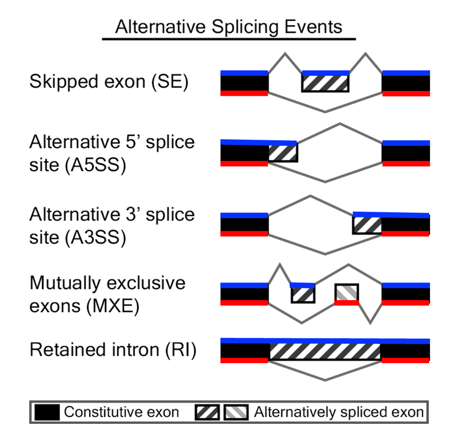
*Alternative splicing event types. Source: [BTEP Coding Club rMATS tutorial](https://bioinformatics.ccr.cancer.gov/docs/btep-coding-club/CC2023/rmats/)*

## Preparing input files

rMATS takes two plain-text files listing the BAM paths for each condition — one BAM path per line **or** all paths comma-separated on a single line. Comma-separated on one line is the standard approach:

```bash
# b1.txt — liver samples
echo "aligned/ENCSR000AEU_rep1/Aligned.sortedByCoord.out.bam,aligned/ENCSR000AEU_rep2/Aligned.sortedByCoord.out.bam,aligned/ENCSR226KML_rep1/Aligned.sortedByCoord.out.bam,aligned/ENCSR504QMK_rep1/Aligned.sortedByCoord.out.bam" > b1.txt

# b2.txt — skin samples
echo "aligned/ENCSR551NII_rep1/Aligned.sortedByCoord.out.bam,aligned/ENCSR460YCS_rep1/Aligned.sortedByCoord.out.bam,aligned/ENCSR321PGV_rep1/Aligned.sortedByCoord.out.bam,aligned/ENCSR991HIR_rep1/Aligned.sortedByCoord.out.bam" > b2.txt
```

> **Important:** Every BAM listed here must have a `.bai` index file next to it (see [Indexing BAM files](#indexing-bam-files) above).

## Running rMATS

```bash
rmats.py \
  --b1 b1.txt \
  --b2 b2.txt \
  --gtf ref/gencode.v49.annotation.gtf \
  --od rmats_out/ \
  --tmp rmats_tmp/ \
  -t paired \
  --readLength 101 \
  --nthread 8 \
  --tstat 8
```

Key flags:
- `-t paired` — paired-end reads
- `--readLength` — the length of your reads (check your FASTQ headers if unsure)
- `--tstat` — threads used for the statistical model (can match `--nthread`)

This will take a while to run (30–60 min depending on resources).

## Pitfalls and gotchas

**Wrong `--readLength`**
This is the most common mistake. `--readLength` must exactly match the length of your reads — off by even 1bp will cause rMATS to miss junction-spanning reads or crash. Check your actual read length:
```bash
zcat fastq/ENCSR000AEU_rep1_R1.fastq.gz | head -2 | tail -1 | tr -d '\n' | wc -c
```

**Trimmed or variable-length reads**
If your reads were adapter-trimmed, they are no longer a uniform length. Pass `--variable-read-length` to handle this:
```bash
rmats.py ... --variable-read-length
```
Note: this flag cannot be used together with a fixed `--readLength`.

**Missing `--libType` (strandedness)**
By default rMATS assumes unstranded data (`--libType fr-unstranded`). Total RNA-seq libraries from ENCODE are typically reverse-stranded — use `--libType fr-firststrand`. Using the wrong setting produces incorrect PSI estimates.
```bash
rmats.py ... --libType fr-firststrand
```

**`--gtf` must match your STAR index**
The GTF passed to rMATS should be the same version used to build the STAR genome index. Mismatched versions cause events to go undetected or coordinates to be wrong.

**The `--tmp` directory fills up**
rMATS writes large intermediate files to `--tmp`. Make sure the filesystem has enough space (several GB for large datasets) and that the directory exists before you run.

**You need at least 2 replicates per group for statistics**
rMATS requires a minimum of 2 samples per condition to fit its statistical model. With only 1 sample per group it will run but report `NA` for p-values.

**BAM files must be sorted and indexed**
rMATS will fail silently or crash if BAMs are not coordinate-sorted and indexed (`.bai` present). See [Indexing BAM files](#indexing-bam-files).

## Output files

rMATS reports five types of alternative splicing events. For each type you get two result files:

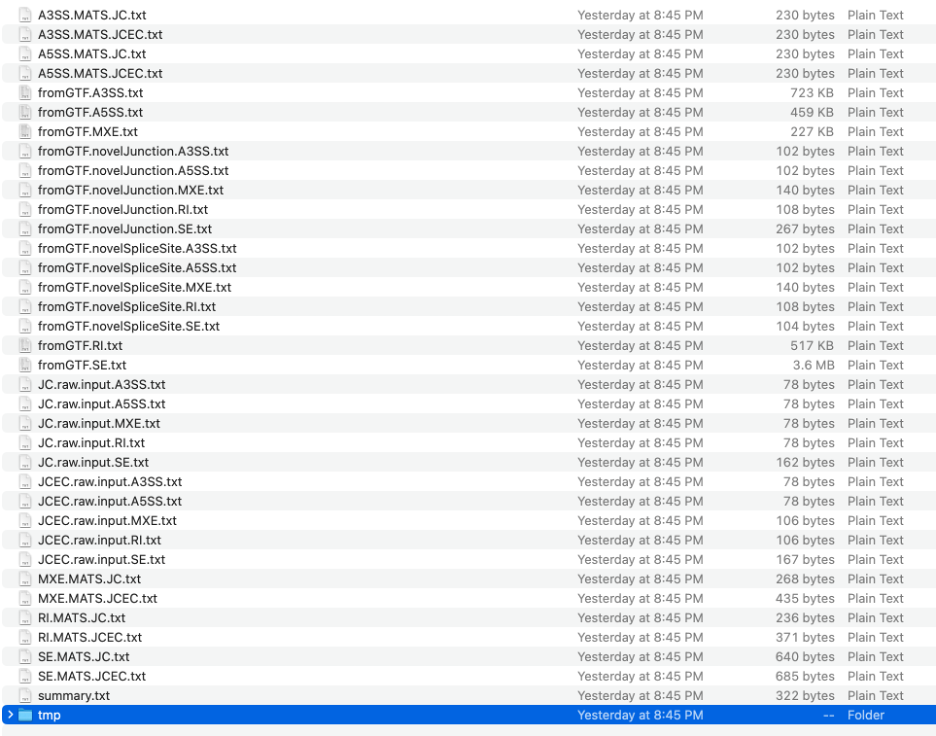
*rMATS output directory structure. Source: [BTEP Coding Club rMATS tutorial](https://bioinformatics.ccr.cancer.gov/docs/btep-coding-club/CC2023/rmats/)*

| Event type | Abbreviation | Description |
|---|---|---|
| Skipped exon | SE | An exon is present in one condition and skipped in the other |
| Alternative 5' splice site | A5SS | The 5' end of an exon differs between conditions |
| Alternative 3' splice site | A3SS | The 3' end of an exon differs between conditions |
| Mutually exclusive exons | MXE | Two exons are never included together |
| Retained intron | RI | An intron is retained in the mature mRNA |

For each event type there are two output files:
- `SE.MATS.JC.txt` — counts from **junction-spanning reads only**
- `SE.MATS.JCEC.txt` — counts from junction reads **plus exon body reads**

For most purposes, `JCEC` is the more complete count matrix. Use `JC` when reads are short relative to the exon size.

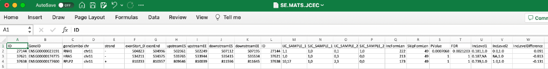
*Example rMATS output file (MATS.JC.txt). Source: [BTEP Coding Club rMATS tutorial](https://bioinformatics.ccr.cancer.gov/docs/btep-coding-club/CC2023/rmats/)*

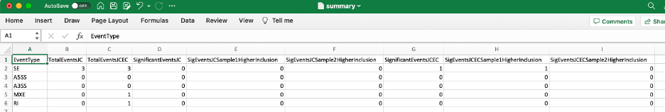
*rMATS results summary file. Source: [BTEP Coding Club rMATS tutorial](https://bioinformatics.ccr.cancer.gov/docs/btep-coding-club/CC2023/rmats/)*

### Key columns in the output

| Column | Meaning |
|---|---|
| `IncLevel1` / `IncLevel2` | PSI (Ψ) values per replicate for group 1 / group 2 |
| `IncLevelDifference` | ΔPSI = mean(IncLevel1) − mean(IncLevel2) |
| `PValue` | p-value from the likelihood ratio test |
| `FDR` | Benjamini-Hochberg adjusted p-value |

## Filtering significant events

A common starting filter for significant differential splicing:

```bash
# FDR < 0.05 and |ΔPSI| > 0.1
awk -F'\t' 'NR==1 || ($20 < 0.05 && ($22 > 0.1 || $22 < -0.1))' \
  rmats_out/SE.MATS.JCEC.txt > SE_significant.txt
```

> Note: Column numbers can shift depending on event type. Check the header line to confirm which columns are `FDR` and `IncLevelDifference`.

## Finding interesting events

After applying a basic FDR and ΔPSI filter you may still have hundreds of events. Here's how to prioritize the most biologically interesting ones.

**What to look for:**

- **Large ΔPSI** — Events with |ΔPSI| > 0.2–0.5 represent substantial splicing changes and are easier to validate
- **Near-complete switches** — One condition PSI ≈ 0, the other ≈ 1 are the most striking and interpretable
- **Consistent replicates** — The comma-separated values in `IncLevel1`/`IncLevel2` should be similar within each group; high variance within a group suggests a noisy event
- **Sufficient read coverage** — Low junction read counts (IJC + SJC < 10–20) produce unreliable PSI estimates regardless of FDR

**Filtering in R** (see [`scripts/05-find-interesting.R`](scripts/05-find-interesting.R) for a ready-to-run version covering all event types):

```r
library(dplyr)

se <- read.table("rmats_out/SE.MATS.JCEC.txt", header=TRUE, sep="\t")

# Summarize per-replicate PSI variance within each group
se$sd1 <- sapply(strsplit(se$IncLevel1, ","), function(x) sd(as.numeric(x), na.rm=TRUE))
se$sd2 <- sapply(strsplit(se$IncLevel2, ","), function(x) sd(as.numeric(x), na.rm=TRUE))

interesting <- se %>%
  filter(
    FDR < 0.05,
    abs(IncLevelDifference) > 0.2,
    IJC_SAMPLE_1 + SJC_SAMPLE_1 >= 20,
    IJC_SAMPLE_2 + SJC_SAMPLE_2 >= 20,
    sd1 < 0.15,
    sd2 < 0.15
  ) %>%
  arrange(FDR)

write.table(interesting, "SE_interesting.txt", sep="\t", quote=FALSE, row.names=FALSE)
```

## Visualizing interesting events

Once you have a shortlist, use `rmats2sashimiplot` to generate sashimi plots for all of them at once:

```bash
rmats2sashimiplot \
  --b1 b1.txt \
  --b2 b2.txt \
  --event-type SE \
  -e SE_interesting.txt \
  --l1 Liver \
  --l2 Skin \
  -o sashimi_out/
```

Each event gets its own plot showing junction-spanning read arcs with PSI values labeled per condition. For a closer look at any individual event, load the BAM files into IGV and navigate to the event coordinates (see [Visualizing splicing (IGV)](#visualizing-splicing-igv) below).


# Visualizing splicing (IGV)

Once you have a list of significant splicing events, IGV is a good way to visually confirm them and build intuition for what the splicing changes look like at the read level.

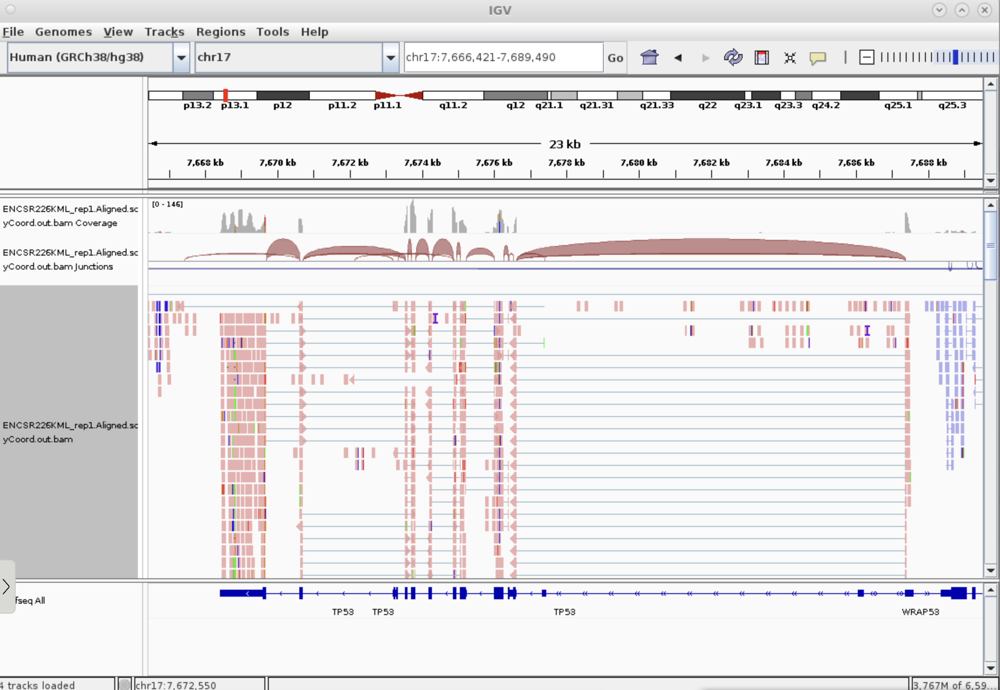


## Loading your data

1. Open IGV and set the genome to **hg38** (Genomes > Load from server > Human (hg38))
2. Load each BAM file: File > Load from File, select `Aligned.sortedByCoord.out.bam` (the `.bai` index must be in the same folder)
3. Optionally load your GTF annotation: File > Load from File, select `gencode.v49.annotation.gtf`

## Navigating to a splicing event

From your rMATS output, pick a significant SE event and note the chromosome and coordinates (`chr`, `exonStart_0base`, `exonEnd`). Type the coordinates into the IGV search bar. You will want to include some amount of flanking sequence on either side of the SE event, but not too much.


## Sashimi plots

Sashimi plots show junction-spanning reads as arcs, with arc thickness proportional to the number of reads spanning that junction. To enable them:

1. Right-click on a BAM track
2. Select **Sashimi Plot**

You should see arcs connecting the exons. A differentially spliced exon will show clearly different arc weights between your liver and skin samples.

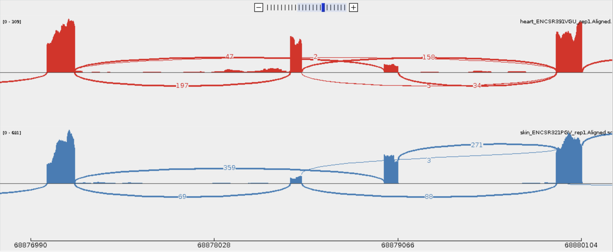

> **Tip:** Group your tracks by condition (all liver together, all skin together) before generating the sashimi plot so the comparison is easy to read.

> **Tip:** It is difficult if you have too many samples on a sashimi plot. Make one large BAM file for each condition and use that for your plot to make the comparison easier to read. You hide sample-sample variability, but it makes an individual plot easier to interpret. You can also use a single representative sample to do the same thing.

> **Tip:** Right-click on the sashimi plot to use the "Set Junction Coverage Min" value to hide low-count junctions.

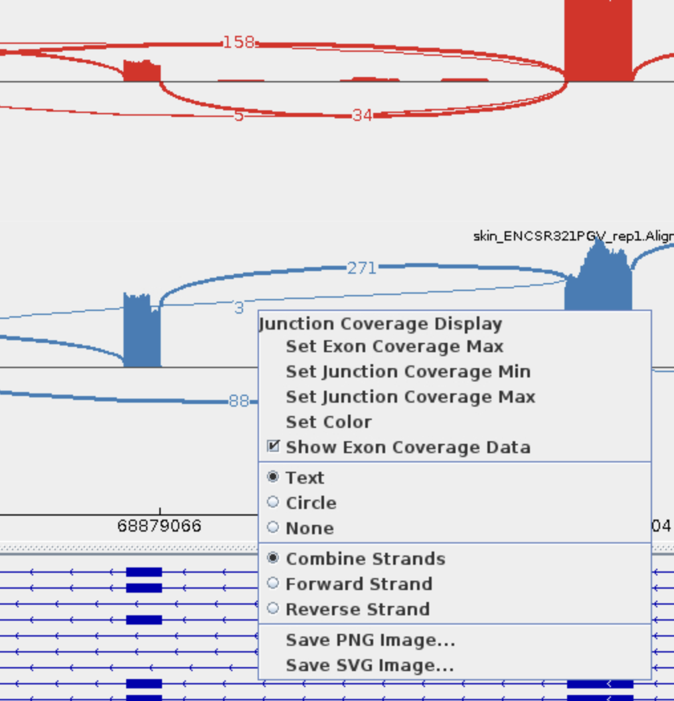

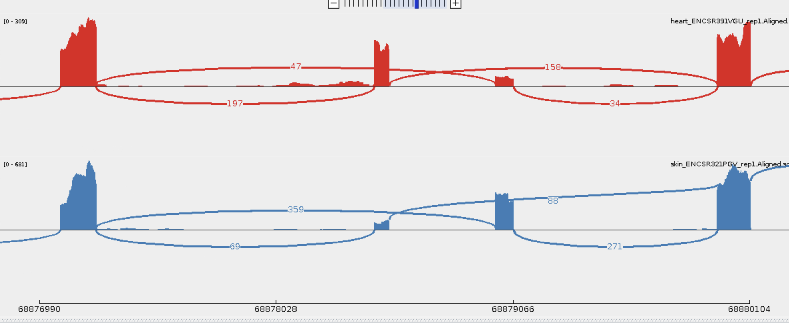


# Downstream Analysis

Splicing analysis is the first step. After you have identified the splice junctions that are differentially spliced, you'll want to understand what they mean biologically — what do these splicing changes do, and why are they happening?

See [downstream.md](downstream.md) for approaches to:
- Predicting protein consequences of splicing changes
- Finding enriched biological processes
- Identifying RNA-binding proteins that may be driving the splicing shift
- Validating top hits experimentally


# HPC Tips and tricks

## Write scripts

Try not to run individual commands at the command-line. Instead write shell/bash scripts. This helps you to keep track of what you ran. Specifically: 

* what version of programs
* what input files / references

It also lets you re-run analyses when/if something changes. 

More importantly, when you are writing up your results, you can refer back to your script to see exactly what commands you ran.

### Try to use a workflow/pipeline manager

It really helps if you use a workflow manager to keep track of jobs. Examples are: Nextflow, cgpipe (mine), or even Makefiles. This is out of scope for this hands-on, but if you think you're going to want to run a pipeline multiple times (new samples), then it can really help make the process faster for the N+1 run. 

### Write to tmp files

If you're using a workflow manager or scripts to run your pipeline, you will need to know if a job failed. The easiest way to do this is to write your final output to a temporary file and only move it to the final version when the job is complete.

Example:

    long_calculation.sh input.bam | gzip > output.txt.gz.tmp && mv output.txt.gz.tmp output.txt.gz

In this example, we are running a long calculation. It may finish correctly or it might error out. We are gzip compressing our output to save disk space. Unless we are tracking if the job completed, we won't know from the files if it worked. By writing to a temp file and using `&& mv ` to rename the temp file to the final file name, we make it possible to know if the job finished successfully -- the output file exists (success) or the tmp file exists (failure).


## Use `screen` or `tmux` for long-running sessions

When working on a cluster's interactive node (or even the head node), your SSH connection can drop and kill any running jobs. To keep your sessions alive, use a terminal multiplexer like `screen` or `tmux`.

**screen** — simple and available on almost every system:
```bash
screen -S rmats          # start a new named session
# ... run your commands ...
# Ctrl+A, then D          # detach (session keeps running)
screen -r rmats          # reattach later
screen -ls               # list active sessions
```

**tmux** — more features, also widely available:
```bash
tmux new -s rmats        # start a new named session
# ... run your commands ...
# Ctrl+B, then D          # detach (session keeps running)
tmux attach -t rmats     # reattach later
tmux ls                  # list active sessions
```

Both tools keep your session running even if you disconnect, which is essential for long jobs like STAR alignment or rMATS. Start a session at the beginning of your work day and reattach to it whenever you reconnect.

## Keep your own reference files

It takes disk space to keep your own copy of reference sequences, but if you have multiple projects / species / versions, it is very helpful to keep your own copies of reference data. This way you can always go back to look at an analysis again.


# Additional resources

* [Differential Alternative Splicing Analysis with rMATS](https://bioinformatics.ccr.cancer.gov/docs/btep-coding-club/CC2023/rmats/) — BTEP Coding Club tutorial covering rMATS on the NIH Biowulf cluster, output interpretation, and complementary tools (RSEM, IsoformSwitchAnalyzeR, DEXSeq)

---

If you have any questions, please feel free to reach out: Marcus R. Breese &lt;mbreese@iu.edu&gt;
